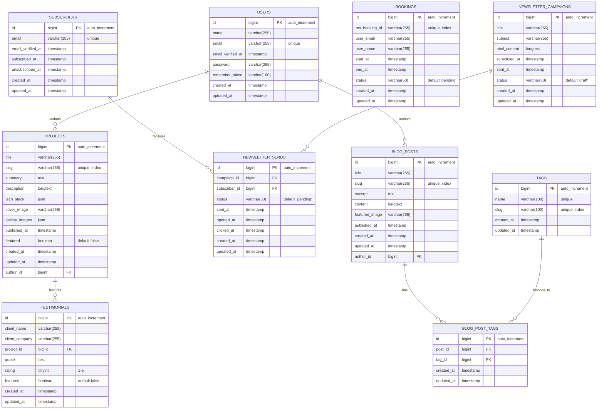

# CoderStew Website — Product Requirements Document (PRD)

_Last updated: 2025-07-18_  

---

## 1 · Mission & Scope
- **Company:** **CoderStew** – freelance web‑app development studio.  
- **Primary conversion goal:** Visitors book a **30‑minute discovery call** via Microsoft Bookings.  
- **Secondary goals:**  
  1. Add **1 000 newsletter subscribers** within 6 months.  
  2. Rank **top‑5** on Google for "freelance web app developer Utah" and related terms.  
- **Phase‑1 exclusions:** No e‑commerce, no gated member area (planned for Phase 2).

## 2 · Essential Background
- **Audience:** Owners & CTOs of small‑ to mid‑sized businesses that need custom web apps.  
- **Current pain points:**  
  1. Unclear pricing.  
  2. Scattered case studies.  
  3. Slow mobile speed.

## 3 · User Personas & Jobs‑to‑Be‑Done

| Name | Role | Goal | Pain‑point | JTBD statement |
|------|------|------|------------|----------------|
| **Megan** | Startup CTO | Ship MVP in < 3 mo | In‑house devs are booked solid | *When my investors approve the MVP budget, I want a freelance team that can start next week so I can hit our beta launch.* |
| **Carlos** | Owner, small manufacturer | Replace fragile Excel workflow | No idea what custom software costs | *When staff keep breaking the sales spreadsheet, I want an upfront quote so I can budget without surprises.* |
| **Lena** | Product Manager @ SaaS | Add white‑label portal | Mobile load times tank | *When users complain about slow mobile pages, I want a proven dev partner who can fix performance so churn drops.* |

---

## 4 · Goals & Success Metrics

| Metric | Baseline (Jul 2025) | Target (Jan 2026) |
|--------|-----------------------|----------------------|
| **Monthly unique visitors** | 1 200 | **6 000** |
| **Discovery‑call bookings** | 8 / mo | **40 / mo** |
| **Newsletter sign‑ups** | 0 | **1 000 total** |
| **Largest Contentful Paint (3G)** | 3.1 s | **≤ 2.5 s** |
| **Time to Interactive (3G)** | 4.0 s | **≤ 3.5 s** |
| **Google Lighthouse SEO** | 78 | **≥ 90** |

---

## 5 · Functional Requirements

| Feature | Priority | Acceptance Criterion (Definition of Done) |
|---------|----------|-------------------------------------------|
| **Backpack for Laravel CMS** | **Must** | Admin creates/edits pages, testimonials, portfolio items & newsletters via Backpack interface; role‑based permissions enforced; changes appear on Vue frontend via API within 5 min. |
| Portfolio gallery w/ filters | **Must** | PrimeVue DataView with filtering; selecting _Tech = Vue_ returns correct subset within 500 ms; smooth PrimeVue animations. |
| Pricing page | **Must** | PrimeVue Card components in responsive grid; clicking **Start** opens PrimeVue Dialog with Bookings embed. |
| Microsoft Bookings embed | **Must** | PrimeVue Dialog component with iframe; booking confirmation sent from existing 365 tenant; event added to company calendar. |
| Contact form + validation + Google reCAPTCHA | **Must** | PrimeVue form components with built-in validation; invalid email shows PrimeVue inline message; spam score ≤ 0.3 passes. |
| **Newsletter (integrated with Laravel API)** | **Must** | PrimeVue InputText with validation → Laravel API → stored in `subscribers` table; double‑opt‑in email sent within 60 s via Laravel queues. |
| Testimonial / case‑study module | **Should** | PrimeVue Carousel component; at least one testimonial auto‑surfaces on every service page; cached API responses < 300 ms. |
| Blog (markdown + tags, RSS) | **Should** | Vue pages consuming Laravel API; publishing post adds it to RSS and updates `sitemap.xml`; PrimeVue Chip components for tags. |
| Admin dashboard (Plausible + GlitchTip) | **Should** | Vue dashboard with PrimeVue Chart components; shows last‑7‑day visitors & error count; dashboard loads < 5 s. |
| Search (Algolia DocSearch) | **Could** | PrimeVue AutoComplete component; typing "Laravel" returns results < 400 ms. |
| Dark‑/light‑mode toggle | **Could** | PrimeVue ToggleButton; state stored in Pinia store and localStorage; PrimeVue theme switching. |

---

## 6 · Non‑Functional Requirements
- **Performance:** LCP < 2.5 s (3G); TTFB < 300 ms; CLS < 0.1.  
- **Security:** Conform to OWASP Top‑10; 2‑factor auth for `/admin`; weekly dependency scan.  
- **Accessibility:** WCAG 2.2 AA; full keyboard navigation; proper ARIA labels.  
- **SEO:** `Organization`, `Service` & breadcrumb schema; Lighthouse SEO ≥ 90.  
- **Compliance:** GDPR & CCPA‑ready; opt‑in cookie banner; DSAR (Data Subject Access Request) email privacy@coderstew.com.  
- **Reliability:** Target ≥ 99.5% uptime monthly; blue‑green Docker deploys with rollback capability.

---

## 7 · Design Requirements

### Color Palette  

**Primary Colors**
| Token | Hex | Usage | Contrast Notes |
|-------|-----|-------|----------------|
| sunburst‑orange | **#FF9410** | Primary CTAs, brand highlights | Use white text (7.2:1) |
| solar‑gold | **#E6C417** | Secondary CTAs, hover states | Use dark text (8.1:1) |
| coastal‑cyan | **#63B1C7** | Links, info badges, testimonial accents | Use white text (4.8:1) |
| lime‑spark | **#70E000** | Success states, confirmation badges | Use dark text (9.2:1) |

**Neutral Scale**
| Token | Hex | Usage | Light Mode | Dark Mode |
|-------|-----|-------|------------|-----------|
| onyx‑900 | **#171717** | Primary text, headers | Main text | Background |
| slate‑800 | **#21282C** | Card backgrounds | Borders | Card surfaces |
| graphite‑700 | **#2A3840** | Secondary text | Subtle borders | Main text |
| steel‑600 | **#3C4C55** | Muted text, icons | Secondary text | Secondary text |
| stone‑500 | **#4E5C64** | Disabled states | Disabled text | Disabled text |
| mist‑400 | **#5E6B72** | Borders, dividers | Light borders | Borders |

**Semantic Colors**
| Token | Hex | Usage |
|-------|-----|-------|
| success‑green | **#10B981** | Success messages, completed states |
| warning‑amber | **#F59E0B** | Warning messages, pending states |
| error‑red | **#EF4444** | Error messages, destructive actions |
| info‑blue | **#3B82F6** | Info messages, helpful hints |

**Background Colors**
| Token | Hex | Usage |
|-------|-----|-------|
| surface‑light | **#FFFFFF** | Light mode backgrounds |
| surface‑dark | **#0F172A** | Dark mode backgrounds |
| surface‑overlay | **#F8FAFC** | Light mode overlays, cards |
| surface‑overlay‑dark | **#1E293B** | Dark mode overlays, cards |

- **Accessibility Standards:**  
  - All color combinations meet WCAG 2.2 AA (4.5:1 minimum)
  - Primary orange and cyan tested for colorblind accessibility
  - Focus states use 3px outline with 2px offset
  - Error states include both color and iconography  
- **Typography:** 
  - **UI Text:** `Inter` (400/500/600) for body copy and UI elements
  - **Headings:** `Chakra Petch` (600/700) for headings and emphasis  
  - **Code:** `JetBrains Mono` (400/500) for code blocks and technical content
- **Logo:** `max-height: 48px` in navigation; maintain aspect ratio.  
- **Icons:** PrimeIcons (included with PrimeVue) supplemented with Lucide Vue icons where needed.  
- **Imagery:** Professional photos with subtle 5% duotone overlay (sunburst‑orange + coastal‑cyan).

---

## 8 · Technical Stack & Integrations

### Architecture
- **Backend:** Laravel 11 with Backpack for Laravel CMS (API-first architecture)
- **Frontend:** Vue 3 with Composition API and TypeScript
- **UI Framework:** PrimeVue 3 with custom theming
- **Build Tools:** Vite for fast development and optimized production builds
- **State Management:** Pinia for Vue store management
- **Routing:** Vue Router for SPA navigation
- **Database:** MySQL 8.0 with Laravel Eloquent ORM
- **API:** Laravel Sanctum for SPA authentication with CSRF protection
- **Queues:** Laravel Horizon with Redis for background jobs
- **Newsletter:** Laravel-based system with queue-driven email sending
- **Email:** SMTP via Microsoft 365 with sending domain `mail.coderstew.com`
- **Hosting:** Self-hosted on Unraid server with Docker containers behind Nginx reverse-proxy (Let's Encrypt SSL)
- **Observability:** GlitchTip (error monitoring), Uptime Kuma (status), Plausible (analytics), custom Vue dashboards

### Data Model

---

## 9 · Risks & Mitigation

| Risk | Impact | Mitigation |
|------|--------|-----------|
| **Self‑hosted infrastructure downtime** | **High** - Lost bookings, damaged reputation | Automated monitoring with Uptime Kuma; documented recovery procedures; backup hosting plan on DigitalOcean; status page for transparency |
| **SPA SEO challenges** | **High** - Reduced organic traffic | Implement Vue SSR/SSG with Nuxt.js consideration; proper meta tags with Vue Meta; prerendering for key pages; structured data implementation |
| **Performance degradation under load** | **Medium** - Poor UX, SEO impact | Vue lazy loading; Vite code splitting; Redis caching; CDN for static assets; database query optimization |
| **PrimeVue bundle size** | **Medium** - Slower initial load | Tree-shaking configuration; selective component imports; async component loading; Vite chunk optimization |
| **API-first architecture complexity** | **Medium** - Development overhead | Standardized API responses; comprehensive API documentation; proper error handling; Laravel API resources |
| **SEO targets not achieved** | **Medium** - Fewer organic leads | Expand keyword targets beyond Utah; consistent content calendar; technical SEO audit; local SEO optimization |
| **Data breach via admin panel** | **High** - Data loss, legal issues | 2FA mandatory for admin; rate limiting; regular security audits; encrypted backups; GDPR compliance |
| **Email deliverability issues** | **Medium** - Failed communications | SPF/DKIM/DMARC setup; monitor sender reputation; backup email service; newsletter double opt-in |
| **Dependency vulnerabilities** | **Medium** - Security exposure | Automated dependency scanning; regular updates; security-focused CI/CD pipeline |

---

## 10 · SEO & Content Strategy

### Target Keywords (Primary)
- "freelance web app developer Utah"
- "custom web application development"
- "Laravel developer Utah"
- "startup web development"

### Target Keywords (Secondary)
- "web app development pricing"
- "custom software development Utah"
- "Vue.js developer freelance"
- "web application consultant"

### Content Calendar
- **Technical blog posts:** 2x monthly (Laravel tutorials, web development tips)
- **Case studies:** 1x monthly (detailed project breakdowns)
- **Industry insights:** 1x monthly (startup tech trends, development best practices)

---

## 11 · Deliverables & Timeline  
_Handled by iterative development with 2-week sprints_

**Phase 1 (Weeks 1-4): Foundation**
- Laravel API setup with Backpack CMS
- Vue 3 + Vite frontend initialization
- PrimeVue integration with custom theme
- Database migration and seeding
- Basic API endpoints and Vue routing

**Phase 2 (Weeks 5-8): Core Features**
- Portfolio system with PrimeVue DataView filtering
- Contact forms with PrimeVue form components
- Microsoft Bookings integration in PrimeVue Dialog
- Newsletter signup with Pinia state management
- Basic blog functionality with Vue pages

**Phase 3 (Weeks 9-12): Polish & Optimization**
- PrimeVue theme customization and dark mode
- Performance optimization (lazy loading, code splitting)
- SEO implementation (Vue Meta, server-side rendering considerations)
- Admin dashboard with PrimeVue Charts
- Testing (Vue Test Utils, Cypress) and deployment

---

## 12 · Legal & Compliance

### Required Pages
- **Privacy Policy**: GDPR/CCPA compliant data handling disclosure
- **Terms of Service**: Service agreement and limitation of liability
- **Cookie Policy**: Transparent cookie usage and consent management

### Data Protection
- **DSAR Process**: Email privacy@coderstew.com for data subject access requests
- **Data Retention**: 7 years for business records, 3 years for newsletter subscribers
- **Consent Management**: Clear opt-in for newsletter, cookies, and data processing

---